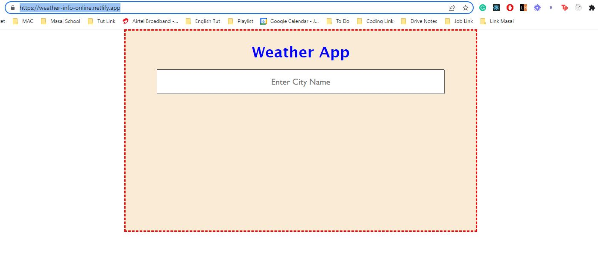
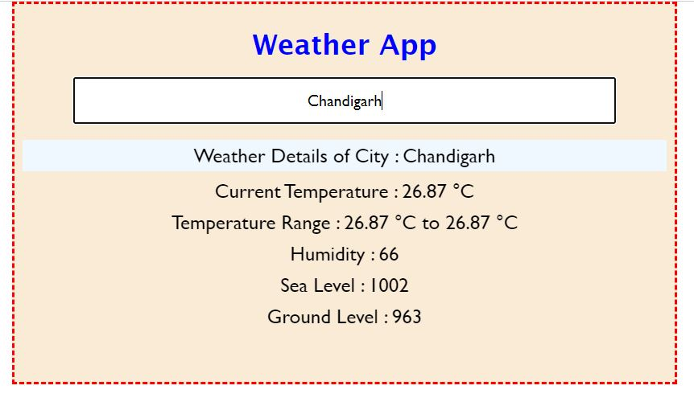
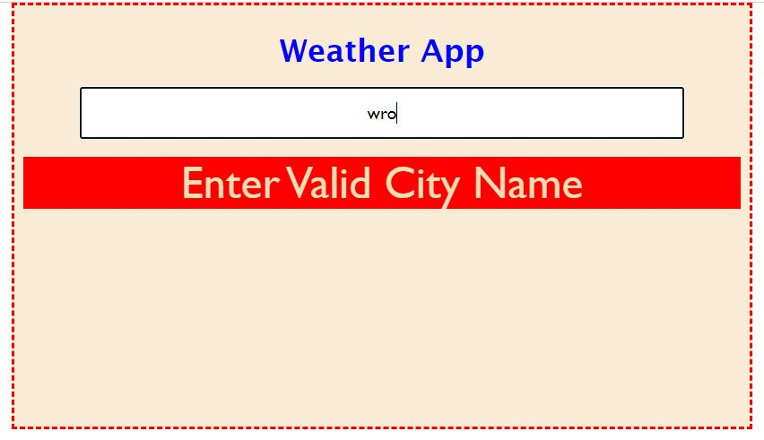

# Weather App in React.js
>## Description 
- Weather Application all user to Enter City Name and all details about weather information. For Example : Current temperature, Temperature range, humadity etc.

>## Deployment Link
- [https://weather-info-online.netlify.app/]("https://weather-info-online.netlify.app/)

>## How to use it
- Go to Link [https://weather-info-online.netlify.app/]("https://weather-info-online.netlify.app/) and Enter City Name

- After Enter city name if enter city name get correct temperature information

- If you Enter wrong city name get warning

>## Tech Stack
- HTML
- CSS
- JavaScript 
- React.js
- Open Weather API

## Developer
>  - ##### [Raushan Kumar](https://github.com/raushansft)

